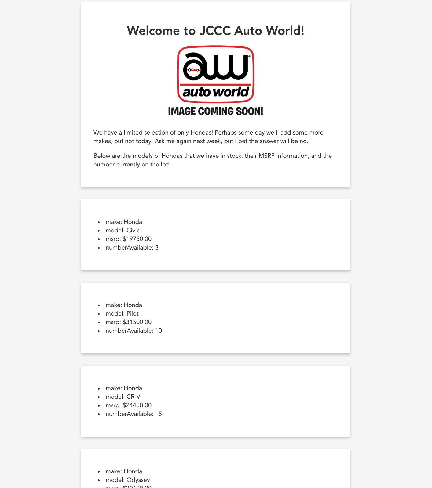

# JCCC Auto World

You have just been hired as a freelance web developer to make a website for a small Honda automotive dealer in town. They have an API that you call to get data about the specific models of Hondas they sell. The data comes back as an **array** of **objects** (see the `data.js` file for the data's "shape" (its properties and property data types)).

Your task is to display the data on the page **if** the model has an `isAvailable: true` property. Here are some rules to make sure you follow:

1. You are to create **ALL** elements with JavaScript.
1. If `isAvailable: false`, do not create a card for the car model.
1. If `isAvailable: true`, create a `div` element and add additional elements to it in any way you'd like to display the data **in a readible manner** - do not just lump all the data in one sentence. Remember, you have a property _name_ and it's _value_. (hint: a bulleted list or a table is totally acceptable - fragments are also your friend)
1. Display the `msrp` property as US dollars - this means you'll need to add a `$` at the beginning and `.00` at the end. **Do not worry about the `,` in the thousandths place**. There are a few ways to accomplish this!
1. **DO NOT** output the `id` or the `isAvailable` properties - the user doesn't need to know that.
1. Don't worry too much about styling - they're not paying you for the stylings. Luckily for you, you've found some CSS styles for the cards and all you need to do is add the `.card` CSS class to the `div` elements! If you have time at the end, feel free to adjust the css found in `style.css`.
1. All of your JS should be written in the `main.js` file.

Your finished product should similar to the following:

---

## Extra Credit!

I will give you **5 points extra credit** for adding images for each car. Go to Google and find its corresponding image and add an `image` property for each car. Then, you'll need to figure out how to handle and render the image properly.
