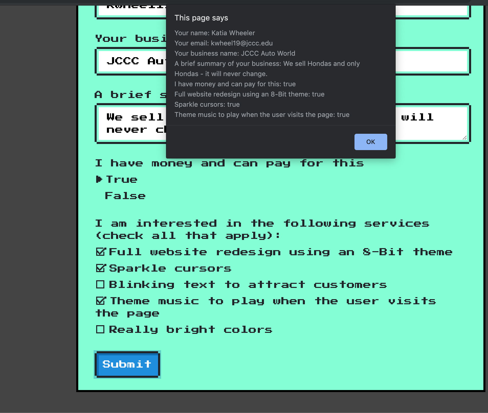

# 8-bit Web Design 

Congrats! You got a job! Your job is a web developer for a company called 8-Bit Web Design - they take websites and convert them into an 8-bit looking web page, much to a user's dismay. 

8-Bit Web Design gains business by companies filling out a form on their main website gathering requirements and then reaching out to said company.

They have already created the form, but are unsure of how to capture all of the values on the form. Your job is to capture the form values when a user clicks the submit button at the bottom of the form and then alert the user **ONCE** of their responses - this means you'll need to make a "copy" of the entire form and *then* alert the user.

## Requirements/Steps

1. Create an `onclick` handler and add it to the submit button any way you'd like - the handler function **must** be defined in the `main.js` file. All of the following steps will be completed inside of the handler.
1. Grab the `input` tags from the form and the `textarea` tag from the form. Each `input` and `textarea` tag has an `id` attribute which is used for associating a `label` with said field - e.g. `<input id="test" /><label for="test">Test</label>` - this knowledge will come in handy later.
1. You **must** keep the form values in the order that they appear - this means that you need to insert the `textarea` field in its correct location. To do this, you will need to convert the `input` tag collection you received to an Array (use `Array.from(collection)` to convert to Array) and use the `splice` method (google 'insert at index javascript array' and you will find how to do this using `splice` if you're having trouble).
1. You will need to create a variable that holds an empty string so you can append the output to it.
1. Iterate over each field (`input`/`textarea`) and do the following:
    - If the `input.type` is a `checkbox` && the `input` is `checked` (it's a property of `input`), append the label of the checkbox (see hint below), its checked value, and a new line (`\n`) to the string variable you created before. Make sure to `continue` inside the if to skip the remaining code of the loop for this input.
    - If the `input.type` is a `radio` && the `input` is `checked` (it's a property of `input`), append the label of 'I have money and can pay for this', its label's text (see hint below) converted to lower case, and a new line (`\n`) to the string variable you created before.Make sure to `continue` inside the if to skip the remaining code of the loop for this input.
    - Otherwise, append the label text (see hint below) and the `input.value`.
1. After the loop, alert the string variable to the user.

**EXTRA CREDIT**
Reset the form values to be an empty string/unchecked (for checkboxes/radio buttons)

## Tips and Tricks
- Getting an input's label: The Node Object of an `input` has a `labels` attribute. This attribute grabs all of the `label` tags that have a `for` attribute assigned to the `id` of the `input`. The `labels` property is an Array. For this exercise, each `input` will have one `label` so you will access said label's text by `input.labels[0].innerText`. The exceptions are `checkbox` and `radio` input types where you will have to modify a few things per the instructions above.
- Checkbox and Radio Button Values: Normally, an `input` has a `value` attribute that contains the value the user inputted. For checkboxes and radio buttons, this `value` is set to `on` if selected and `off` if not. They also have an `input.checked` attribute that displays the value of `true` or `false`. Use the `input.checked` value for this exercise.
- **PSEUDO-CODE YOUR LOGIC** - it will help you tremendously!!!

Your finished product should similar to the following:

